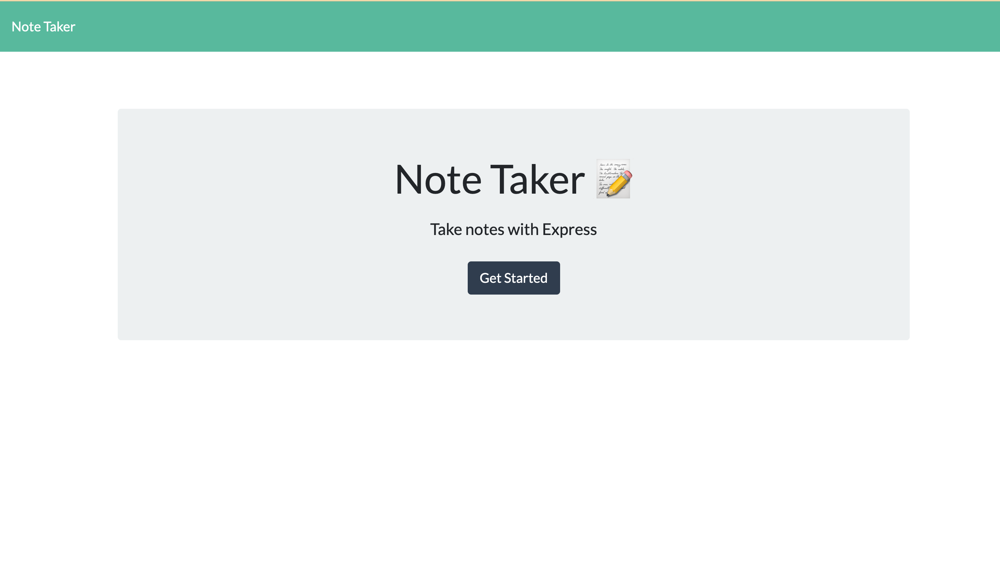

# noteTaker
```
## Description
The Note taker is an useful application, for jotting down quick notes for school, business, or leisure.
The note taker currently writes and saves notes. The note taker also has backend capabilities in which it retrieves and stores JSON data. 
```
## Usage
You will need import all necessary packages by running npm init and npm install respectively from the command line in the terminal. Next run node server.js from command line and open the local host in the browser. First you will be directed to the homepage where you can push the notes button to be routed to the note taking page. Notes can be saved from this page. JSON data can be retrieved from the back-end and each note has a unique id number! 

## Built With
 * "express": "^4.18.1"
 *  "uuid": "^9.0.0" 

## Mockup 

